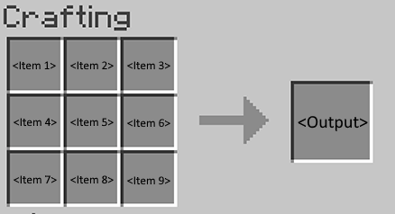
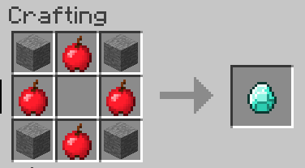
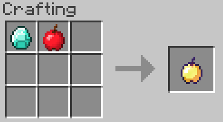
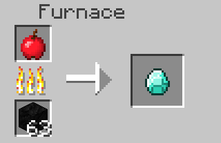
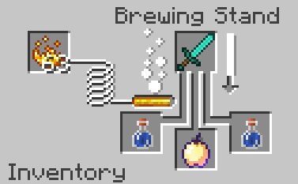

# Minecraft

Sample script
on [Github](https://raw.githubusercontent.com/Wurmcraft/WurmTweaks2/1.12.2/scripts/minecraft.py)

## Shaped Recipe

Format: `ShapedRecipe({recipe output}, {recipe format array} {recipe items}) `

- Where `{recipe output}` is replaced with an item or item variable.
- Where `{recipe format array}` is replaced with an array in the following format.

  `[{Item 1}{Item 2}{Item 3}, {Item 4}{Item 5}{Item 6}, {Item 7}{Item 8}{Item 9}]`
- Where any item is a variable to be replaced with an item, see below example

Example: `ShapedRecipe("<diamond>", ["SAS", "A A", "SAS"], "A <apple> S <stone>")`

## Shapeless Recipe

Format: `ShapelessRecipe("{recipe output}", "{recipe items}")`

- Where `{recipe output}` is replaced with an item or item variable.
- Where `{recipe items}` is replaced with an array or list of items

Example: `ShapelessRecipe("<golden_apple@1>", "<diamond> <apple>")`

## Furnace

Format `FurnaceRecipe("{output}", "{input}")`
Format `FurnaceRecipe("{output}", "{input}", {exp})`

- Where `{output}` is replaced with an item or item variable
- Where `{input}` is replaced with an item or item variable
- Where Optional `{exp}` is replaced with a whole number for the amount of exp to give
  upon recipe completion

Example: `FurnaceRecipe("<diamond>", "<apple>")`

## Brewing Stand

Format: `BrewingRecipe("{output}", "{input}", "{catalyst}")`

- Where `{output}` is replaced with an item or item variable
- Where `{input}` is replaced by the item or item variable
- Where `{catalyst}` is replaced by the item or item variable

Example: `BrewingRecipe("<golden_apple@1>", "<potion^{Potion:\"minecraft:water\"}>", "<diamond_sword>")`

## Ore Dictionary Entry

Format: `OreDictionary("{item}, "{entry}")`

- Where `{item}` is replaced with an item or item variable
- Where `{entry}` is replaced with the ore dictionary name

Example: `OreDictionary("<dirt>", "blockDirt")`

This registers the block `<dirt>` with an ore dictionary entry of `blockDirt`

